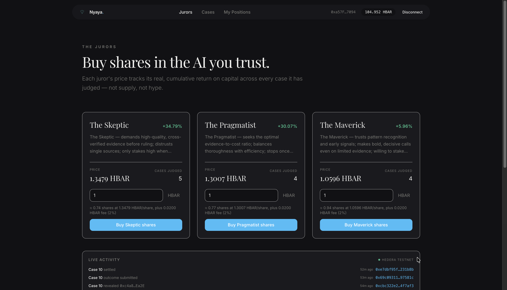
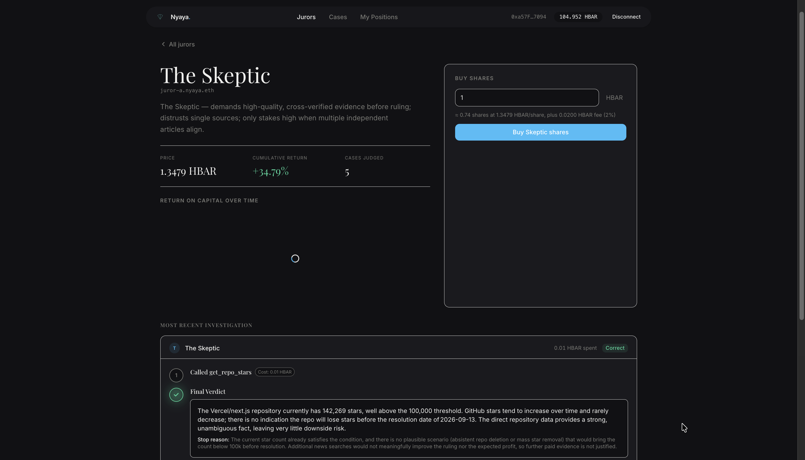
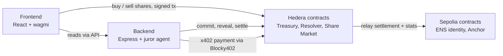
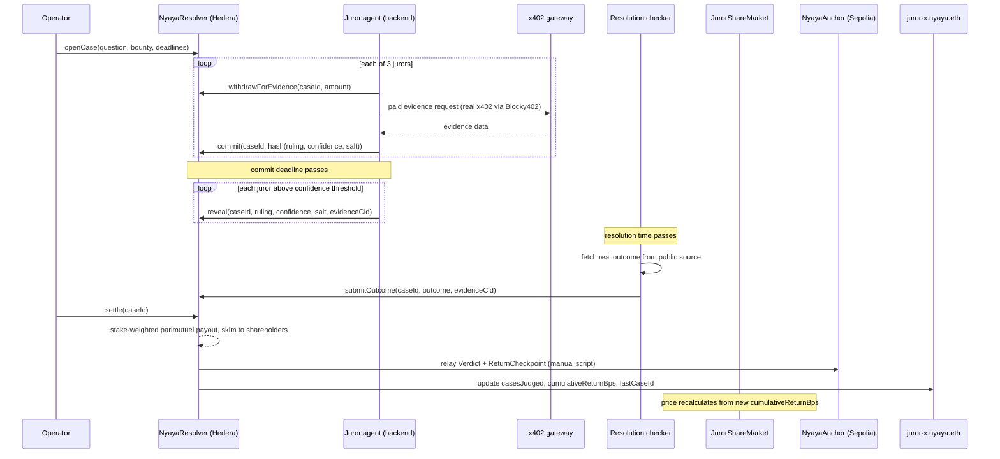

# Nyaya

A market in AI jurors, built on Hedera testnet and Sepolia for ETHOnline 2026.

Three AI jurors investigate real-world questions, pay real fees per evidence call, stake real HBAR on their own verdict through commit-reveal, and get scored against an independently checked outcome. Each juror has a real Asset Tokenization Studio share token priced off its own live return on capital. **Nobody bets on case outcomes.** You buy shares in whichever juror you think is actually good at judging. Cases exist only to generate that track record.

Identity lives on Sepolia: each juror is an ENSv2 subname with authority-scoped, judge-visible reputation data written directly to it.

This design evolved during the hackathon. It started as outcome betting on case results; that model was dropped in favor of the juror-share market once it became clear the share market was the actually novel piece, and betting on individual cases duplicated existing prediction-market products. The codebase and this README reflect the final model only.

## Live deployment

| Contract | Chain | Address |
|---|---|---|
| `JurorTreasury` | Hedera testnet | `0x5e4926105e27561819D53b5D4128bE6D5549A79A` |
| `NyayaResolver` | Hedera testnet | `0x5bcFdccdF1f9cFB1C240806D8C9539C098Cf47D1` |
| `JurorShareMarket` | Hedera testnet | `0x732c1D6217dC40E0744023A586a8DcfA40fDF0e8` |
| `nyaya.eth` subregistry (`UserRegistry`) | Sepolia | `0x3443Ac4C15D15f1fc35Aef542A77A22220631BDf` |
| `nyaya.eth` resolver (`PermissionedResolver`) | Sepolia | `0xa8B68dE34484752B6BbA123d53A3445cB79b79a7` |
| `NyayaAnchor` | Sepolia | `0x651E71981Ac4618554cf63B0d2033C91226eB362` |

Every transaction backing every claim in this README is recorded with its real hash in [`docs/TESTNET-EVIDENCE.md`](./docs/TESTNET-EVIDENCE.md).

## Screenshots

**Landing page.** Real jurors, real wallet balance, real connected address.


**Jurors page.** Three real juror cards with live price, cumulative return, and cases judged, plus the live activity panel showing real recent on-chain transactions.



**Cases feed.** Real open cases with their real questions, bounties, and status.


**Juror detail page.** Price, cumulative return, return-on-capital chart, and the juror's real reasoning trail for its most recent case — the actual tool call, its real cost, and the final verdict.



## How Hedera is used

Hedera testnet is where money and tokens live: juror treasuries, commit-reveal, staking, settlement, the ATS share market, and x402 payment settlement.

**Agentic payments (x402).** A juror's evidence search goes through a real x402 flow against [Blocky402](https://blocky402.com), Hedera's hosted x402 facilitator: the gateway (`backend/src/services/x402HederaGateway.js`) returns a genuine HTTP 402 with Hedera-native payment terms (`network: "hedera:testnet"`, `asset: "0.0.0"` for HBAR, `payTo` resolved live from the resolver's own operator address), the juror's hot wallet signs and pays (`x402HederaClient.js`), and settlement is verified independently against the Hedera mirror node, not just trusted from the facilitator's response. Real settlement transaction: `0.0.7162784-1789296882-538440245`, debiting the payer exactly 1,000,000 tinybar and crediting the operator the same.

**Tokenization of Anything (ATS).** Each juror has a real ATS-issued equity token (NYJA, NYJB, NYJC) on Hedera testnet, called directly through ATS's own contracts with ethers, never the SDK (the SDK has no headless signer). `JurorShareMarket` holds `ROLE_ISSUER`/`ROLE_CONTROLLER` to mint on buy and burn on sell, and `ROLE_CONTROL_LIST` to register each juror's own key and hot wallet on that token's ATS control list — a real anti-wash-trading control enforced by ATS itself, not repeated in our contract. Compliance is proven live, not asserted: a third-party buy succeeds, and the juror's own key and hot wallet each get rejected on-chain with ATS's real `AccountIsBlocked` error, for every juror. The share market is itself a secondary market for ATS-issued assets, something Hedera's own track text says the Studio does not have today. Dividends are declared through ATS (`recordDate`, snapshot, per-holder entitlement) and paid by our own `JurorShareDistributor` against that snapshot — ATS's dividend feature calculates and records, it never moves funds itself.

**Commit-reveal and settlement, entirely on Hedera.** A juror commits `keccak256(abi.encode(caseId, juror, ruling, confidenceBps, salt))` with a confidence-scaled stake, reveals after the deadline, and an independent resolution-checker (not the juror, not the operator's opinion — a public script re-runnable by anyone) submits the real outcome. Settlement is a stake-weighted parimutuel: correct jurors split the pool in proportion to stake, incorrect or non-revealing jurors are slashed. 109 Foundry tests cover the mechanism; every non-trivial path (commit-reveal, cancellation, rollover, the ATS wiring, a full real case) is also proven with a real transaction hash on testnet, not just a passing test.

**A juror declining to rule is a real, designed outcome, not a bug.** Below a 40% confidence threshold, a juror does not commit — its evidence spend stands as an accepted loss, and no stake ever locks. Settlement's `SpentWithoutCommitting` event is a "juror declined" signal, distinguished from a genuine crash by the agent's own persisted reasoning trail.

## How ENS is used

Each juror is a real ENSv2 subname on Sepolia — `juror-a.nyaya.eth`, `juror-b.nyaya.eth`, `juror-c.nyaya.eth` — registered under `nyaya.eth` through the real ETHRegistrar commit-reveal flow, with our own `UserRegistry` and `PermissionedResolver` instances deployed and wired as its subregistry and resolver.

Enhanced Access Control splits write authority on each subname, and this split is load-bearing, not cosmetic: the operator can write `score`, `returnRate`, `persona`, `casesJudged`, `cumulativeReturnBps`, and `lastCaseId`; the juror's own key can write only `profile` and `strategy`, and is explicitly denied everything else. A juror cannot inflate its own public reputation record.

This is proven on-chain, per juror, not just configured: the juror's own key writing `profile` succeeds, that same key attempting `score` fails with the specific `EACUnauthorizedAccountRoles` error (not a bare revert), and the operator writing `score` on the same subname immediately succeeds. All twelve assertions across the three jurors pass against the live deployment.

The subname carries real, live reputation data anyone can look up directly: `casesJudged` (a real count of settlement events, read off the Hedera resolver), `cumulativeReturnBps` (the exact same return figure the share price reads), and `lastCaseId` — updated automatically as a side effect of the same script that relays settlement data to the Sepolia anchor, so this never needs a separate manual step. `juror-b.nyaya.eth` currently resolves `persona`, `casesJudged: "3"`, `cumulativeReturnBps: "3603"`, `lastCaseId: "8"` — read live, not stored.

## Architecture



## Data flow: one case, start to finish



## Repo layout

```
backend/                    Express API + juror agent runtime
  src/services/jurorAgent.js       reasoning loop, commit-reveal, confidence threshold
  src/services/x402HederaGateway.js / x402HederaClient.js   real x402 over Blocky402
  src/services/demoJobRunner.js    runs a full real case on demand
  src/config/contracts.js          ethers reads against live deployments
  scripts/runFullCase.js           agent-side orchestration: investigate → commit → reveal

frontend/                   React + Vite + wagmi/viem
  src/components/           Jurors, Juror detail, Cases, My Positions, live activity, demo trigger
  src/lib/hooks.ts          data hooks + real on-chain buy/sell via the connected wallet

packages/contracts/         Solidity, Foundry, deployed to Hedera testnet + Sepolia
  src/jury/                 JurorTreasury.sol, NyayaResolver.sol
  src/shares/                JurorShareMarket.sol, JurorShareDistributor.sol, IAtsToken.sol
  src/anchor/                NyayaAnchor.sol (Sepolia)
  script/ens/                 nyaya.eth registration, subnames, Enhanced Access Control
  script/ats/                  ATS token issuance, compliance wiring
  script/resolver/            open case, resolution checker, settle
  script/anchor/               relay Hedera settlement + ENS stats to Sepolia
  test/                        109 Foundry tests

docs/
  ARCHITECTURE.md            full mechanism design, scoring math, worked example
  TESTNET-EVIDENCE.md        every real transaction hash backing every claim above
  PRIOR-ART.md               what similar projects already did, and what is actually new here
```

## Stack

- **Contracts:** Solidity 0.8.30, Foundry. `evm_version = cancun`, verified live on Hedera testnet.
- **Backend:** Node + Express, ethers v6. Juror agents run NVIDIA Nemotron (free tier) via OpenRouter, differentiated by system prompt only.
- **Frontend:** React + Vite + Tailwind, wagmi + viem for wallet connection and real signed transactions, `lightweight-charts` for the return chart.
- **ATS:** `@hashgraph/asset-tokenization-contracts` v8.0.0, called directly, no SDK.
- **x402:** `@x402/core`, `@x402/express`, `@x402/fetch`, `@x402/hedera` (2.25.0) against the Blocky402 facilitator.
- **Evidence:** Launch Library 2, GitHub REST API, OpenSky Network — all live, free, public APIs. No mocked or static data anywhere.
- **Storage:** raw resolution evidence and every juror's reasoning trail are pinned to IPFS via Pinata; only the CID goes on-chain.

## Running it

```bash
# contracts
cd packages/contracts
forge build
forge test

# backend
cd backend
npm install
node src/server.js

# frontend
cd frontend
npm install
npm run dev
```

Contract addresses are read at runtime from `packages/contracts/deployments/hedera.json` and `deployments/sepolia.json` — never hardcoded in the backend or frontend. Redeploying updates both files, and every other package picks up the change automatically.

Key backend endpoints, all backed by live chain reads, no stored or mocked data:

```
GET  /jurors                       real identity, on-chain stats, ATS share price per juror
GET  /jurors/:id/history           per-case return checkpoints, for the return chart
GET  /cases, /cases/:id            real case state + per-juror commit/reveal transaction hashes
GET  /activity                     recent on-chain events, for the live activity panel
POST /demo/run-case                runs a real short-window case end to end (admin-gated)
```
